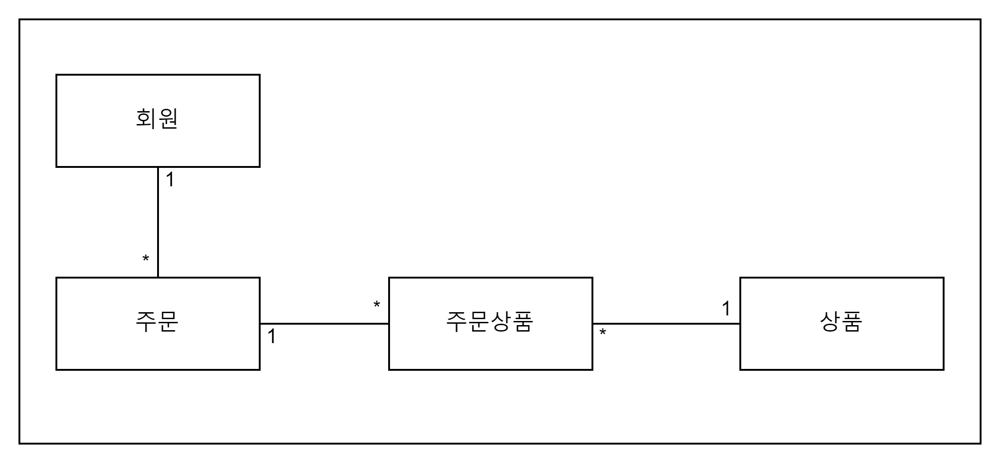
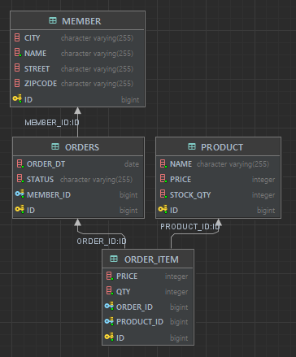

# JPA Programming Example

실무도 진행하고 있지만, 개발 도서를 보고 새로운 것을 얻고 한번 더 정리하는 법이 필요할 듯 싶다. 

참고도서 : 자바 ORM 표준 JPA 프로그래밍 (지음:김영한)

## 1. Requirements

1. 회원은 상품을 주문할 수 있다. 
2. 주문 시 여러 종류의 상품을 선택할 수 있다.
- 회원기능
    - [ ] 회원 등록
    - [ ] 회원 조회
- 상품기능
    - [ ] 상품 등록
    - [ ] 상품 수정
    - [ ] 상품 조회
- 주문 기능
    - [ ] 상품 주문
    - [ ] 주문 내역 조회
    - [ ] 주문 취소

## 2. Domain UML

## 3. DB
- ERD

- Local : H2 DB
  - console url : localhost:8080/h2-console
  - remote url : jdbc:h2:tcp://localhost:9092/mem:jpa_programming_example
